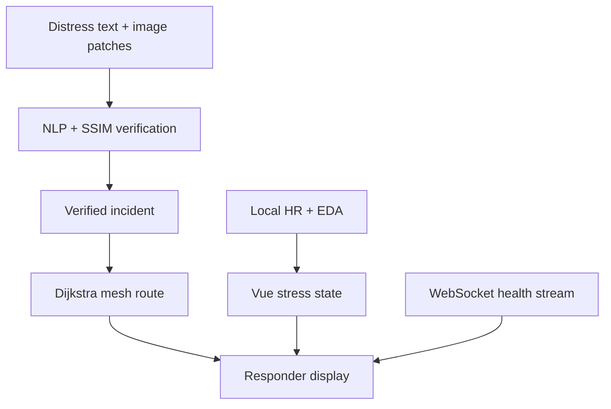

# Neuro-Sync Response™ — Judge Demo Runbook

## 90-second demo

1. Sign in and open **Neuro-Sync Lab**.
2. Point out the live WebSocket, simulated MQTT state, peer count, latency and local-only privacy status.
3. Click **Verify incident**. Explain that distress NLP and SSIM must both agree before the incident becomes `VERIFIED CRITICAL`.
4. Click **Simulate node failure**. The selected relay turns red and Dijkstra immediately highlights the lowest-cost surviving green route.
5. Click **Simulate high stress**. Local HR/EDA values cross the threshold and the interface switches to the minimal OLED-black exit HUD.
6. Click **Return to calm mode** to restore the full operational display.

## Architecture

## What is executable

- Weighted distress-term scoring and coordinate extraction.
- Server-side SSIM calculation over equal grayscale image samples.
- Dijkstra shortest-path calculation over a weighted graph.
- Click-to-fail nodes, route recalculation and animated packet movement.
- Full-duplex WebSocket health stream.
- Local HR/EDA signal generation and Vue reactive stress listener.
- Automatic high-stress HUD and manual recovery.

## What is simulated

- Satellite imagery is deterministically generated rather than downloaded from a provider.
- MQTT broker state is simulated over the live WebSocket channel.
- IEEE 802.11s nodes are software graph nodes rather than physical radios.
- HR/EDA values are synthetic and are not a medical diagnosis.

## Key viva answers

**Why use two signals for verification?**  Text can be misleading and imagery can contain harmless change. Requiring distress language plus a structural anomaly reduces single-signal false positives.

**Why Dijkstra?**  Edge weights represent link cost or latency. Dijkstra finds the minimum-total-cost route among online nodes and can be rerun whenever topology changes.

**Why process biometrics locally?**  The UI needs only a derived stress state. Keeping raw samples in browser/device memory reduces privacy exposure and network dependence.

**Is this production-ready?**  It is a functional software prototype. Production requires authenticated device identities, a real MQTT broker, 802.11s-capable hardware, calibrated wearable models, satellite-provider contracts and emergency-service validation.
